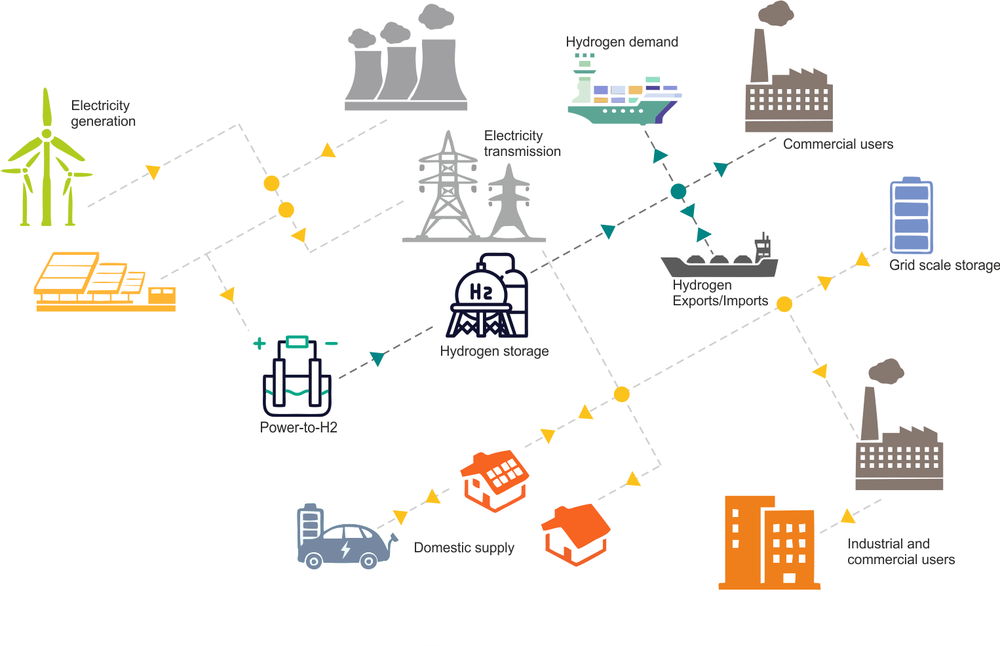

.. image:: https://pascua.iit.comillas.edu/aramos/oHySEM_v2.png
   :target: https://ohysem.readthedocs.io/en/latest/index.html
   :alt: logo
   :align: center

|

\ **o**\ptimized \ **Hy**\brid  \ **S**\ystems for \ **E**\nergy and \ **M**\arket management **(oHySEM)**

|

.. image:: https://img.shields.io/pypi/v/ohysem
    :target: https://badge.fury.io/py/oHySEM
    :alt: PyPI

.. image:: https://img.shields.io/pypi/pyversions/ohysem
   :target: https://pypi.org/project/oHySEM/
   :alt: PyPI - Python Version

.. image:: https://img.shields.io/readthedocs/ohysem
   :target: https://ohysem.readthedocs.io/en/latest/index.html#
   :alt: Read the Docs

.. image:: https://app.codacy.com/project/badge/Grade/c676f237a6cc4fc88a2439da0611ae2f    
   :target: https://app.codacy.com/gh/IIT-EnergySystemModels/oHySEM/dashboard?utm_source=gh&utm_medium=referral&utm_content=&utm_campaign=Badge_grade
   :alt: Codacy Badge

.. image:: https://img.shields.io/pypi/l/ohysem
   :target: https://github.com/IIT-EnergySystemModels/oHySEM/blob/main/LICENSE
   :alt: PyPI - License

.. image:: https://img.shields.io/pepy/dt/ohysem
   :target: https://www.pepy.tech/projects/ohysem
   :alt: Pepy Total Downloads

======================================================================================================

``Simplicity and Transparency in Power Systems Operation and Planning``

**oHySEM** is an open-source model distributed as a Python library, designed to provide optimal planning, operation, and management strategies for hybrid renewable electricity-hydrogen systems. It supports both stand-alone and grid-connected systems in participating in electricity and hydrogen markets, ensuring the seamless integration of new assets and efficient system scheduling.

Table of Contents
=================

1. `Overview <#overview>`_
2. `Features <#features>`_
3. `Architecture <#architecture>`_
4. `Installation <#installation>`_
5. `Usage <#usage>`_
6. `Use Cases <#use-cases>`_
7. `Contributing <#contributing>`_
8. `License <#license>`_

---

Overview
========

**oHySEM** provides a robust framework for optimizing hybrid energy systems, incorporating renewable electricity and hydrogen networks. The library is designed for users needing advanced tools for integrated resource planning, asset integration, system scheduling, and market participation in electricity and hydrogen markets.

Key Applications:
-----------------

- **Optimal Planning & Scheduling**: Ensure efficient energy resource management in hybrid systems.
- **Integrated Resource Planning (IRP)**: Plan long-term energy strategies integrating multiple energy sources.
- **Market Participation**: Engage in real-time electricity markets and future hydrogen markets.
- **Asset Integration**: Seamlessly incorporate new assets (e.g., renewable generators, storage units) into the system.
- **Self-scheduling**: Operation planning of the hybrid system. 

---

Features
========

oHySEM offers a comprehensive suite of features for advanced energy system management:

- **Integrated Energy System Modeling**:
    - Simulate and optimize hybrid systems combining renewable electricity sources (e.g., Solar PV, Wind), conventional generation (e.g., CCGT), and hydrogen technologies (production, storage).
    - Model Battery Energy Storage Systems (BESS) for short-term flexibility.

- **Multi-Horizon Planning and Optimization**:
    - **Long-Term Asset Planning**: Support for strategic decisions on the optimal location and sizing of new energy assets (hydrogen tanks, BESS units, generation).
    - **Mid-Term Asset Optimization**: Tools for yearly planning to optimize asset utilization and adapt to market changes.
    - **Short-Term Operational Planning**: Detailed weekly and daily operational scheduling with fine-grained temporal resolution (15-minute to 1-hour intervals).

- **Advanced Operational Capabilities**:
    - **Hydrogen and Battery Optimization**: Optimize the coordinated operation of hydrogen systems (electrolyzers, storage) and BESS.
    - **Efficient Scheduling**: Align system operations with energy demands, grid requirements, and market conditions in real-time.

- **Comprehensive Market Participation**:
    - **Multi-Market Integration**: Participate in various electricity markets, including day-ahead, intraday, real-time, and secondary reserve markets.
    - **Profitability Maximization**: Optimize market bids and reserve contributions to enhance profitability.
    - **Imbalance Management**: Address deviations in energy supply and demand through effective imbalance settlement mechanisms.

- **System Design and Scalability**:
    - **Grid-Connected & Stand-Alone Systems**: Model both grid-connected systems interacting with the broader network and self-sufficient off-grid systems.
    - **Flexible Asset Integration**: Dynamically incorporate new energy assets into system models.
    - **Scalable Architecture**: Suitable for a range of applications from small-scale VPPs to large-scale hybrid power plants.
    - **Support for Various Solvers**: Compatible with Gurobi, HiGHS, SCIP, GLPK, and CBC.

---

Architecture
============

oHySEM is built around a core optimization model developed in Python using the Pyomo_ library. The main logic resides in ``oHySEM/oHySEM.py``.

The system takes input data primarily from CSV files, typically located in a case-specific directory (e.g., ``oHySEM/VPP1/``). These files define parameters for the energy system, market conditions, and other operational constraints.

oHySEM processes this data to find optimal strategies and outputs the results in CSV format for detailed analysis and generates various plots for visualization.

A Streamlit_-based API (``oHySEM/oHySEM_API.py``) is also available to provide a user interface for interacting with the model.

The following diagram illustrates the general system components and interactions that oHySEM models:

.. _Pyomo: https://pyomo.readthedocs.io/
.. _Streamlit: https://streamlit.io/

---

Installation
============

**Installing solvers:**

- Gurobi: ``conda install -c gurobi gurobi``
- HiGHS: ``pip install highspy``
- SCIP: ``conda install -c conda-forge pyscipopt``
- GLPK: ``conda install glpk``

You can list available Pyomo solvers by running::

  pyomo help -s

**Installing oHySEM** via `pip <https://pypi.org/project/oHySEM/>`_:

.. code-block:: bash

    pip install ohysem

For the full setup guide, refer to the `installation guide <https://pascua.iit.comillas.edu/aramos/oHySEM_installation.pdf>`_.

**From GitHub:**

1. Clone the `oHySEM repository <https://github.com/IIT-EnergySystemModels/oHySEM.git>`_
2. Navigate to the folder: ``cd path_to_repository``
3. Install with: ``pip install .``

**Solvers**:

- `HiGHS <https://ergo-code.github.io/HiGHS/>`_ (free)
- `Gurobi <https://www.gurobi.com/>`_ (academic license available)
- `GLPK <https://www.gnu.org/software/glpk/>`_ (free)
- `CBC <https://github.com/coin-or/Cbc/releases>`_ (free)

**Additional requirements:**

- `Pandas <https://pandas.pydata.org/>`_
- `psutil <https://pypi.org/project/psutil/>`_
- `Plotly <https://plotly.com/python/>`_, `Altair <https://altair-viz.github.io/#>`_, `Colour <https://pypi.org/project/colour/>`_
- `NetworkX <https://networkx.org/>`_

---

Usage
=====

**Running oHySEM:**

After installation, you can run the model via the command line:

.. code-block:: bash

    oHySEM

or using the Python script:

.. code-block:: bash

    python -m oHySEM --dir {path_to_input_data} --case {case_name} --solver {solver_name}

**Running the API:**

To run the Streamlit API, navigate to the directory containing the ``oHySEM_API.py`` file (typically the root of the ``oHySEM`` package or the repository root if running from source) and execute:

.. code-block:: bash

    streamlit run oHySEM_API.py

This will open the interface in your web browser.

The Streamlit API provides an interactive web interface for a more user-friendly workflow with oHySEM. Key functionalities include:

- **Project and Run Configuration:**
    - Set essential parameters for the model run such as the case directory, specific case name, choice of solver, and simulation start date and duration.
    - Toggle options for saving detailed raw results and generating plots.

- **Input Data Management and Modification:**
    - **Time Horizon:** Define the active time steps for the simulation by adjusting the ``oH_Data_Duration_{case_name}.csv`` file.
    - **Electricity Tariffs:** Activate or deactivate specific electricity purchase tariffs. This modifies ``oH_Data_ElectricityCost_{case_name}.csv`` by setting costs for deactivated tariffs to a high prohibitive value.
    - **Hydrogen Demand:**
        - Configure overall H2 demand parameters like ``DemandType`` (Hourly, Daily, Weekly), ``TargetDemand``, and ``RampDemand`` (modifies ``oH_Data_Parameter_{case_name}.csv``).
        - Detail daily demand profiles using a dynamic scheduler for up to 6 time segments (modifies ``oH_Data_HydrogenSchedule_{case_name}.csv``).
    - **H2 Market Conditions:** Set market prices for selling H2 and costs for buying H2.
    - **Technology Parameters:** Adjust operational parameters for specific units of various technologies (Electrolyzers, Wind, Solar PV, BESS, H2ESS), impacting their respective data files. For example, changes to Wind/Solar PV capacities will proportionally scale their ``VarMaxGeneration`` data.
    - Changes to these datasets can be saved directly through the interface.
    - The API also allows for visualization of various input time series data (e.g., electricity prices, demand forecasts) before running the model.

- **Model Execution:**
    - Launch the oHySEM optimization model directly from the interface using the configured settings and modified data.
    - Receive feedback on the execution status (success or error).

- **Result Visualization:**
    - **KPI Dashboard:** View key performance indicators such as total net cost, hydrogen production, and electricity sales/purchases.
    - **Interactive Charts:** Explore results through various Altair charts, including operating costs, energy balances (electricity and hydrogen), storage levels (BESS and H2ESS), and electrolyzer commitment status.

This interface facilitates scenario analysis by allowing users to easily modify inputs, run the model, and immediately see the impact on results through integrated visualizations.

---

Use Cases
=========

- **Grid-connected Hybrid Systems**: Optimize energy flows between electricity and hydrogen markets while meeting grid regulations.
- **Stand-alone VPPs**: Use oHySEM to ensure optimal operation for off-grid renewable systems.
- **Integrated Resource Planning (IRP)**: Plan the addition of new renewable assets and storage units to meet long-term energy goals.
- **Market Participation**: Optimize market bids for both electricity and future hydrogen markets.

---

Contributing
============

Contributions to oHySEM are welcome! Please refer to our Contributing Guide for more information on how to contribute to the project.

---

License
=======

oHySEM is licensed under the GPL-3.0 license. See the `LICENSE file <https://github.com/IIT-EnergySystemModels/oHySEM/blob/main/LICENSE>`_ for details.

---

How to Cite
===========

If you use oHySEM in your research, please cite the following publication:

- E.F. Alvarez, P. Sánchez-Martín and A. Ramos, "Self-Scheduling for a Hydrogen-Based Virtual Power Plant in Day-Ahead Energy and Reserve Electricity Markets," 20th International Conference on the European Energy Market (EEM), Istanbul, Turkiye, June 2024, pp. 1-6, `10.1109/EEM60825.2024.10608848 <https://doi.org/10.1109/EEM60825.2024.10608848>`_.

**BibTeX entry**:

.. code::

    @INPROCEEDINGS{10608848,
      author={Alvarez, Erik F. and Sánchez-Martín, Pedro and Ramos, Andrés},
      booktitle={2024 20th International Conference on the European Energy Market (EEM)},
      title={Self-Scheduling for a Hydrogen-Based Virtual Power Plant in Day-Ahead Energy and Reserve Electricity Markets},
      year={2024},
      volume={},
      number={},
      pages={1-6},
      doi={10.1109/EEM60825.2024.10608848}
    }
