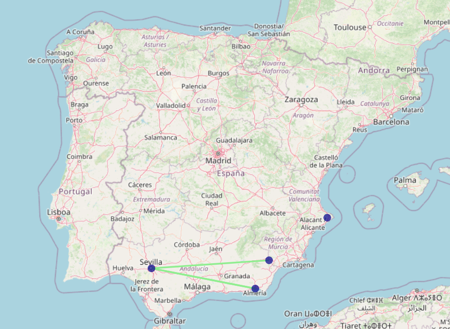
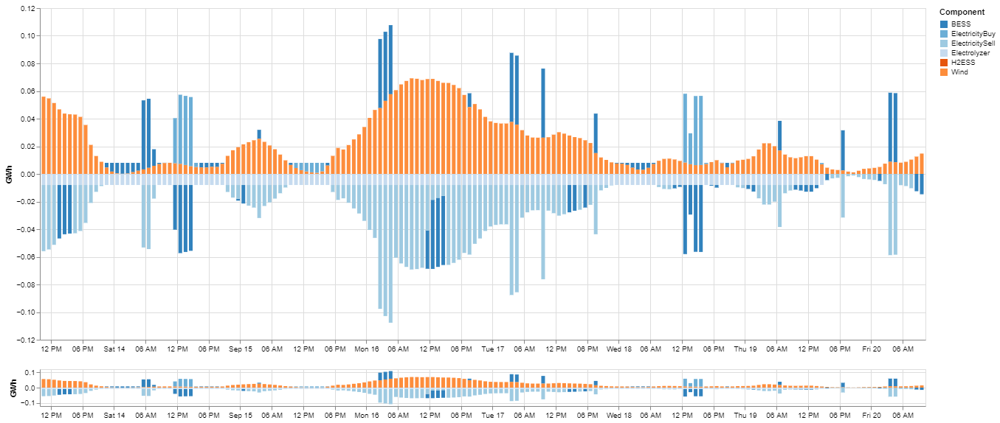
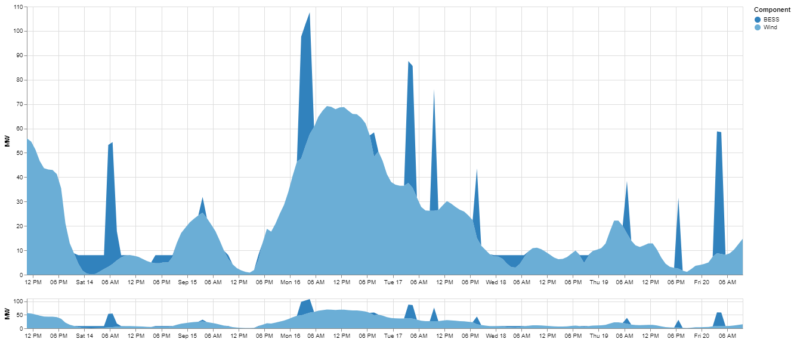

.. oHySEM documentation master file, created by Erik Alvarez

Output results
==============

The output includes several maps of the electricity and hydrogen network and plots showing the energy share of different technologies.

Some other additional plots are also plotted by the model.

In addition, the model generates several other plots to visualise key results. The CSV files used to store the output results are of three types:

1. **Derived/Transformed Values**: Files that are derived or transformed from the values of variables.
2. **Optimisation variable values**: Files related to the values of each variable in the optimisation problem.
3. **Dual Values of Constraints**: Files containing the dual values associated with the constraints.

Unit conventions:
------------------

- For the first type (derived/transformed values), power is expressed in **MW**, energy in **GWh**, cost in **M€** and hydrogen in **kgH2**.
- For the last two types of CSV files (values of optimisation variables and dual values of constraints), power is expressed in **GW**, cost in **M€** and hydrogen in **tH2**.

CSV files for derived/transformed values
----------------------------------------

File ``oH_Result_rTotalCost_{Case Name}.csv``

============  ==========  ==========  =========  ====  ==========  ============================
Identifier                                             Header      Description
=====================================================  ==========  ============================
Period        Scenario    Load level  Component  Date  MEUR        Total costs and profits
============  ==========  ==========  =========  ====  ==========  ============================

File ``oH_Result_rElectricityBalance_{Case Name}.csv``

============  ==========  ==========  =========  ====  ==========  =======================================================
Identifier                                             Header      Description
=====================================================  ==========  =======================================================
Period        Scenario    Load level  Component  Date  GWh         Generation, consumption, flows, losses and demand [GWh]
============  ==========  ==========  =========  ====  ==========  =======================================================

File ``oH_Result_rHydrogenBalance_{Case Name}.csv``

============  ==========  ==========  =========  ====  ==========  =======================================================
Identifier                                             Header      Description
=====================================================  ==========  =======================================================
Period        Scenario    Load level  Component  Date  tH2         Generation, consumption, flows, losses and demand [tH2]
============  ==========  ==========  =========  ====  ==========  =======================================================

File ``oH_Result_rElectricityNetworkFlows_{Case Name}.csv``

============  ==========  ==========  ============  ==========  =======  ====  ==========  =======================================================
Identifier                                                                     Header      Description
=============================================================================  ==========  =======================================================
Period        Scenario    Load level  Initial Node  Final Node  Circuit  Date  GWh         Electricity flows in the network [GWh]
============  ==========  ==========  ============  ==========  =======  ====  ==========  =======================================================

File ``oH_Result_rHydrogenNetworkFlows_{Case Name}.csv``

============  ==========  ==========  ============  ==========  =======  ====  ==========  =======================================================
Identifier                                                                     Header      Description
=============================================================================  ==========  =======================================================
Period        Scenario    Load level  Initial Node  Final Node  Circuit  Date  tH2         Hydrogen flows in the network [tH2]
============  ==========  ==========  ============  ==========  =======  ====  ==========  =======================================================

File ``oH_Result_rElectricityTechnologyGeneration_{Case Name}.csv``

============  ==========  ==========  =========  ====  ==========  =======================================================
Identifier                                             Header      Description
=====================================================  ==========  =======================================================
Period        Scenario    Load level  Component  Date  GWh         Electricity generation by technology [GWh]
============  ==========  ==========  =========  ====  ==========  =======================================================

File ``oH_Result_rReservesOffers_{Case Name}.csv``

============  ==========  ==========  ====  =========  ====  ==========  =======================================================
Identifier                                                   Header      Description
===========================================================  ==========  =======================================================
Period        Scenario    Load level  Unit  Component  Date  GWh         Reserves offers by technology [GWh]
============  ==========  ==========  ====  =========  ====  ==========  =======================================================

CSV files for optimisation variables
------------------------------------------

Each file in this category is named
``oH_Result_v**{Variable Name}**_{Case Name}.csv``

The structure of the CSV file is as follows

============= ===== ===== ========== ==========
Variable Name Index Value LowerBound UpperBound
============= ===== ===== ========== ==========

CSV files for dual values of constraints
----------------------------------------

Each file in this category is named
``oH_Result_e**{Constraint Name}**_{Case Name}.csv``

The structure of the CSV file is as follows

=============== ===== ===== ========== ==========
Constraint Name Index Value LowerBound UpperBound
=============== ===== ===== ========== ==========
